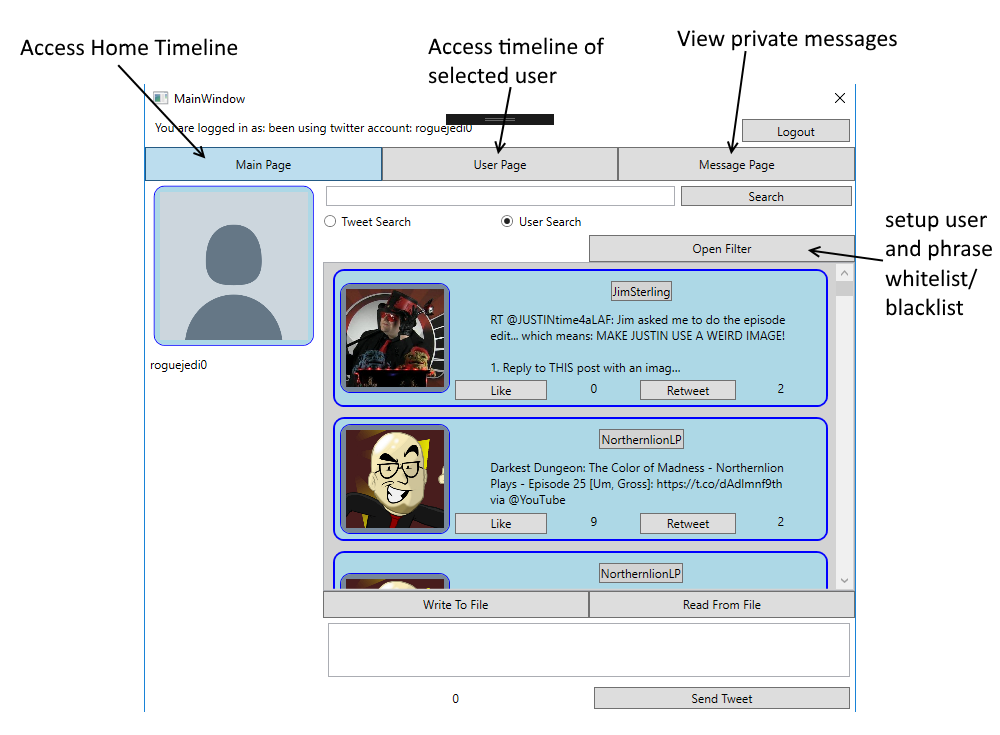

# Desktop Twitter
This application acts as a desktop wrapper for Twitter, using WPF and the Tweetinvi C# Library to allow the user to send Tweets, follow other accounts, view private messages, and much more. This project was created in a small group as a part of a final project for an Object Oriented Programming course. 
### Goals
While the primary focus of the project was to fufill the instructor's desires (have an application login, read and write to a text file, ect.), our group added the following goals for the project.
* Follow SOLID Principles and the MVVM design pattern
* Create an intuitive and easy-to-use UI
* Add additional features, such as more advanced searching tools and ability to view individual user timelines
## Installation
To install, simply download the files, extract them to a desired location, and then run the "setup" application located in Installer/Debug. This is a standard Microsoft installer and will setup .NET as needed along with all the application's dependent libraries in the folder of your choosing. *Note: there is an issue where the program will sometimes crash when logging in the first time it is ran. This has to do with allocating isolated storage, but I have not resolved the issue. If this occurs, simply relaunch the application and it will run normally*
## Tutorial
When the program launches, you will be met with a login screen. This is the application login (not the Twitter login), so login or create an account and then login.

The next window will contain a built-in web browser that directs you to authorize the app. Provide the credentials to your twitter account and select "Authorize" to recieve a pin number, then copy the pin number to the textbox and log in.

The final window holds all the main features of the application. 

